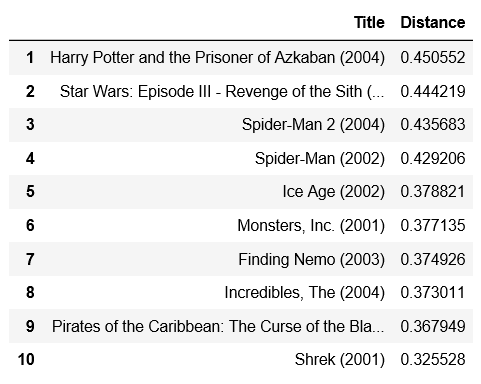
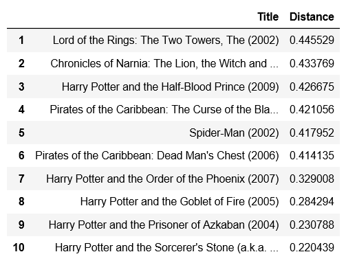
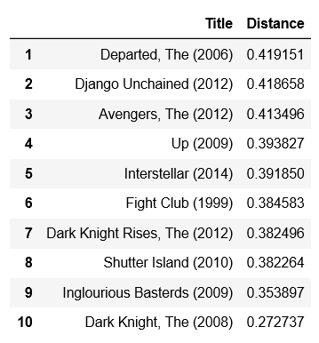
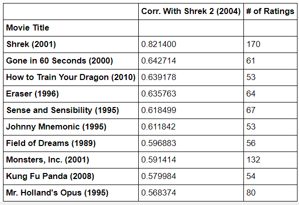
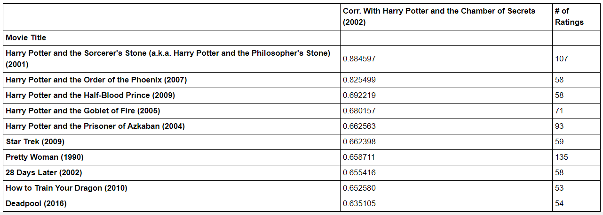
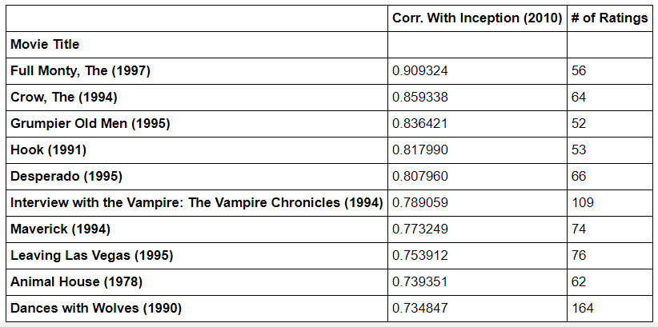

# Movie Recommendation System Model

**Authors:** Alex Valencia, Mallory Wilson

## Overview
The goal of this project is to create the best movie recommendation system model for MovieLens, a movie recommendation service, so they can better predict which movies each user will want to watch next.

## Business Problem
MovieLens would like their customers to use their movie recommendation service to find movies they're most interested in watching. In order to do this, we will create the best movie recommendation system model to help predict the top ten most similar movies each user should watch based on their prior movie selections.

## Data
We examined the dataset ratings.csv on **userId**, **movieId**, and **rating**.

We examined the dataset movies.csv on **movieId** and **title**.

We examined the dataset tags.csv on **userId**, **movieId**, and **tag**.

We examined the dataset links.csv on **movieId**, **imdbId**, and **tmdbId**.

## Methods
We explored all four datasets provided to gain a better understanding of what information we were working with. After exploring all of the data, we decided to focus exclusively on the 'ratings' dataset and the 'movies' dataset.

### Baseline Model
For our Baseline Model, we made additional changes to the 'ratings' dataset by reshaping it in the following ways:

1. 'movieId' was set as the index.
2. 'userId' was set as the columns.
3. 'rating' was set as the values within the newly designed dataset.
4. Any ratings with a *NaN* value was changed to zero.

We filtered our datasets by counting the number of ratings each movie received, and then we kept all movies that received votes from 10 or more users.

This visualization shows the number of users who voted for each movie, and the red line represents which movies had votes from 10 or more users.


We filtered our datasets even more by counting the number of times a user rated a movie, and then we kept all users who had voted for 50 or more movies.

This visualization shows the number of times a user voted for a movie, and the red line represents which users voted for 50 or more movies.


We combined these two filters together and created our final dataset we used to build our recommendation system model.

Next, we inserted the ratings from our final dataset in a **CSR Matrix** because it's the best tool that helps reduce sparsity in our model. Then we took our CSR Matrix and fit it into a KNN algorithm called **NearestNeighbors**. This allowed us to select *cosine similarity* as a metric in our recommendation system model so we could find the top ten most similar movies to recommend based on what movies each user decides to watch.

### Final Model
For our Final Model, we merged the 'ratings' dataset with the 'movies' dataset. We filtered the merged dataset by calculating the mean of ratings for each movie and converted it into a new dataframe called 'ratings_data'. We added a new column called '# of ratings' where we counted the number of ratings each movie received.

This visualization shows the most frequent mean ratings on the rating scale from the 'ratings_data' dataset.


We created a new dataframe where we correlated the ratings from a selected movie with the rest of the movies from the 'ratings_data' dataset. And to ensure the top ten strongest correlation values were picked up, we only accepted movies that received 50 or more ratings from users. 

## Results
After building a function for our Baseline Model, we were able to recommend ten movies to users based on which movie they decided to watch first.

This visualization shows the top ten movies our user should watch after selecting **Shrek 2**.



This visualization shows the top ten movies our user should watch after selecting **Harry Potter and the Chamber of Secrets**.



This visualization shows the top ten movies our user should watch after selecting **Inception**.



After building a function for our Final Model, we were able to figure out the top ten most recommended movies with stronger correlations and we reveal how many ratings each recommended movie received.

This visualization shows the top ten movies our user should watch after selecting **Shrek 2**.



This visualization shows the top ten movies our user should watch after selecting **Harry Potter and the Chamber of Secrets**.



This visualization shows the top ten movies our user should watch after selecting **Inception**.



We imported the Surprise library to find the RMSE for our Baseline Model and our Final Model. Our best RMSE score from the Baseline Model came from the Singular Value Decomposition (SVD) model where the RMSE = 0.8715. Our best RMSE score from the Final Model came from the Singular Value Decomposition (SVD) model where the RMSE = 0.7877.

## Deployment
We were able to deploy an app of our Final Model onto our local computer. We briefly explain below what we did to create the app:

### Requirements

We used Python 3.8.5, Flask 1.1.2, and scikit-learn 0.23.2. All python packages can be found in the `requirements.txt` file.  The requirements are in `pip` style, because this is supported by Heroku.

We created a new `conda` environment to use this deployment:
```bash
conda create --name flask-env pip
conda activate flask-env
pip install -r requirements.txt
```

It only included the requirements for the Flask app.

### Running the Flask Application

To run in a development environment (on your local computer), run:
```bash
export FLASK_ENV=development
env FLASK_APP=app.py flask run
```

This produced the output below:
```
 * Serving Flask app "app.py" (lazy loading)
 * Environment: development
 * Debug mode: on
 * Running on http://127.0.0.1:5000/ (Press CTRL+C to quit)
 * Restarting with stat
 * Debugger is active!
 * Debugger PIN: <PIN>
```

This server needs to stay running in the terminal for the application to work. If you want to do something else in the terminal, you need to open a new window/tab, or shut down the server with CTRL+C. **DO NOT** just close the terminal window when you are done running the Flask app — it will keep running in the background and cause problems until you locate the process ID and terminate it — always make sure you use CTRL+C.

You need to copy the URL http://127.0.0.1:5000/ and paste it into a web browser. You should see the homepage of the example app and use it to receive movie recommendations!

## Next Steps
One idea we would like to pursue in the future is to make a recommendation system model based on movie tags. You would use this model to figure out the correlation between tags for movies with similar tags and use that information to output movie recommendations based on how similar the tags are to each other. We used a small dataset from MovieLens to create our movie recommendation system model and we want to use a bigger dataset so we can include more movies for improved performance. Achieving this may require using a computer that can handle more storage or figuring out a solution to free up storage on our current computers. We also want to find the demographics of each user so we can better predict which movies they will want to watch next.

## Conclusions
Our Final Model is the best performing recommendation system model in selecting ten movies that were the most similar to the movie chosen by the user. This is because it's RMSE is significantly smaller compared to our Baseline Model, and it's able to select recommended movies with significantly stronger correlation values. In the end, making the decision whether or not to watch a movie comes down to each user's personal preferences.

## For More Information
Please review our full analysis in [our Jupyter Notebook Baseline Model](./notebooks/alex/movie_recommendation_system.ipynb), [our Jupyter Notebook Final Model](./notebooks/mallory/final_notebook.ipynb), or our [presentation](./Golf_Sponsorship_for_our_client.pdf).

For any additional questions, please contact **Alex Valencia at asvalencia1688@gmail.com or Mallory Wilson at mallorye1103@gmail.com.**

## Repository Structure

```
├── data                                  <- data files used for analyses
├── images                                <- visualizations created
├── notebooks                             <- code written for project with explanation, as well as working ├──notebooks of members
├── Golf_Sponsorship_for_our_client.pdf   <- PDF version of powerpoint
└── README.md                             <- overview of project
```
